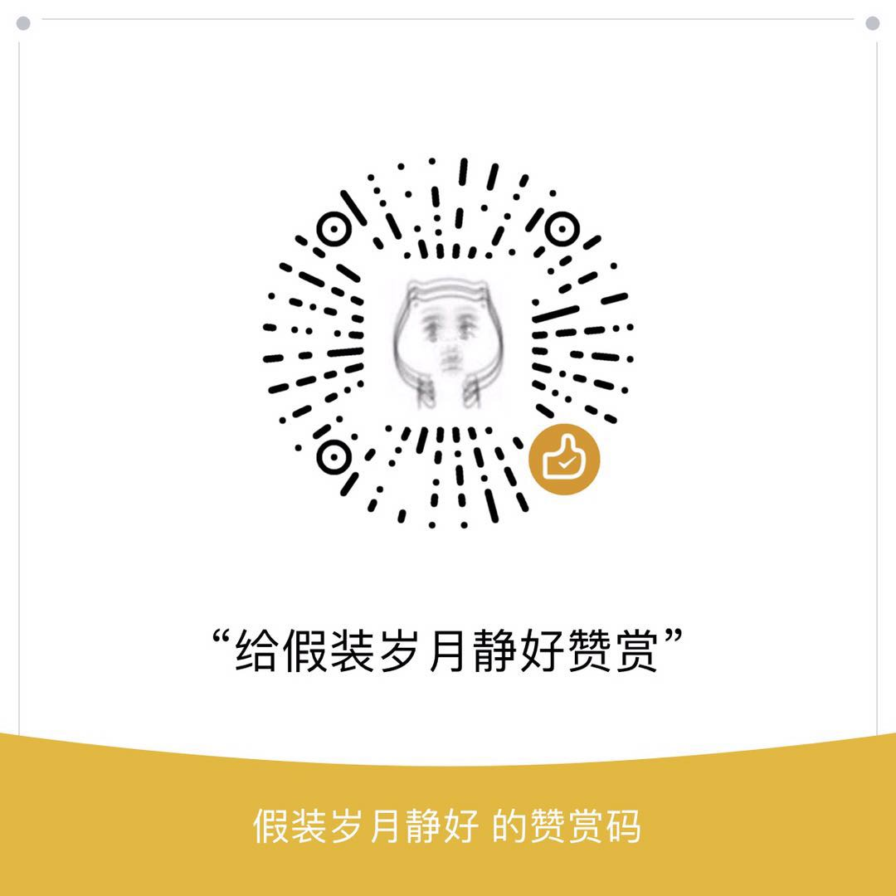

# 新闻邮件推送

## 配置邮箱

config/mail.json

```json
{
    "host" : "name.example.com",
    "port" : "80",
    "username" : "example@example.com",
    "password" : "example@example.com",
    "send_from" : "example@example.com",
    "send_to" : "example@example.com"
}
```

## 执行脚本

```sh
sh build.sh
```

## 查收邮件

# 听说你想请我喝下午茶？😏

{:height="50%" width="50%"}
